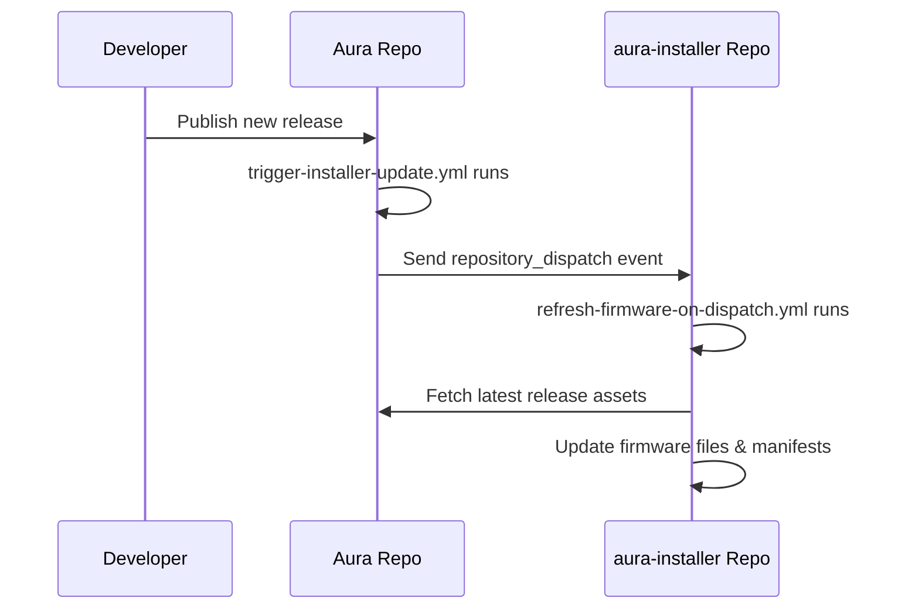

# Aura Installer Integration Setup

This document explains how to set up automatic web installer updates when new firmware releases are published.

## Overview

When you publish a new release in this Aura firmware repository, the web installer repository (`OakesekAo/aura-installer`) is automatically notified and updates its firmware files and manifests.

## Setup Instructions

### 1. Create Personal Access Token (PAT)

1. Go to GitHub Settings → Developer settings → Personal access tokens → Tokens (classic)
2. Click "Generate new token (classic)"
3. Set expiration and select these scopes:
   - ✅ `repo` (Full control of private repositories)
   - ✅ `workflow` (Update GitHub Action workflows)
4. Click "Generate token" and copy the token value

### 2. Add PAT as Repository Secret

1. Go to this repository → Settings → Secrets and variables → Actions
2. Click "New repository secret"
3. Name: `INSTALLER_PAT`
4. Value: Paste your PAT token
5. Click "Add secret"

### 3. Verify Workflow

The workflow file `.github/workflows/trigger-installer-update.yml` is already configured and will:

- ✅ Trigger on new release publications
- ✅ Send dispatch event to `aura-installer` repo
- ✅ Include release tag and URL in payload
- ✅ Log the dispatch event for debugging

## How It Works



## Testing the Integration

1. **Create a test release** in this repository
2. **Check the Actions tab** for successful workflow run
3. **Verify the installer repo** receives the dispatch and updates

## Workflow Details

### Trigger Event
```yaml
on:
  release:
    types: [published]
```

### Dispatch Payload
```json
{
  "event_type": "aura-release",
  "client_payload": {
    "release_tag": "v1.0.2-web-installer",
    "release_url": "https://github.com/OakesekAo/Aura/releases/tag/v1.0.2-web-installer"
  }
}
```

### Target Repository
- Repository: `OakesekAo/aura-installer`
- Event Type: `aura-release`
- Endpoint: `https://api.github.com/repos/OakesekAo/aura-installer/dispatches`

## Troubleshooting

### Common Issues

**❌ Workflow doesn't trigger**
- Check if release is marked as "published" (not draft or pre-release)
- Verify workflow file is in `.github/workflows/` directory
- Check Actions tab for any error messages

**❌ Dispatch fails with 401 Unauthorized**
- Verify `INSTALLER_PAT` secret exists and has correct value
- Ensure PAT has `repo` and `workflow` permissions
- Check if PAT has expired

**❌ Dispatch succeeds but installer doesn't update**
- Verify `aura-installer` repo has matching workflow
- Check if event type matches (`aura-release`)
- Review installer repo's Actions tab for workflow runs

### Debug Commands

Check if secret is set:
```bash
# This will show if the secret exists (but not the value)
gh secret list
```

Test dispatch manually:
```bash
# Replace YOUR_PAT with actual token
curl -X POST \
  -H "Accept: application/vnd.github.v3+json" \
  -H "Authorization: token YOUR_PAT" \
  https://api.github.com/repos/OakesekAo/aura-installer/dispatches \
  -d '{"event_type": "aura-release"}'
```

## Security Notes

- ✅ PAT is stored as encrypted secret
- ✅ PAT only has necessary permissions
- ✅ Workflow only runs on release events
- ✅ No sensitive data in workflow logs

## Next Steps

After setup:
1. **Publish a test release** to verify integration
2. **Monitor both repositories** for successful automation
3. **Update documentation** in installer repo if needed

---

For questions or issues, create an issue in this repository with the "automation" label.
